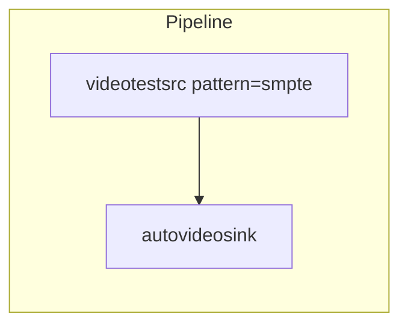

## Introduction

In today's digital world, multimedia streaming applications are everywhere. Video on demand like Netflix and YouTube; live streaming platform like Twitch; interactive tools like Zoom. And even vision AI framework like [NVIDIA DeepStream SDK](https://developer.nvidia.com/deepstream-sdk) all rely on processing media streams to function.

GStreamer is a versatile library designed for building these multimedia applications. It provides rich set of plugins that can be seamlessly linked and arranged to create a wide range of streaming solutions — not just video player, but also live streaming service and editing tools.

Bulit in C, GStreamer takes advantage of this elegant programming language, whose foundational principle are well-explained in [The C Programming Language](https://en.wikipedia.org/wiki/The_C_Programming_Language). However, developing real-world applications with C-based libraries often involves managing complex system details, placing a significant burden on developers to handle memory manually.

### Rust? Rust!

[Rust](https://www.rust-lang.org/) offers a compelling alternative to C in many domains. With its memory safety guarantees, Rust prevents crashes that are common in C-based multimedia applications, while delivering performance comparable to C — making it an excellent match for GStreamer.

The GStreamer team officially maintains a project [**gstreamer-rs**](https://gitlab.freedesktop.org/gstreamer/gstreamer-rs) that provides safe APIs and interfaces. This enables developers to build GStreamer-based multimedia systems in Rust with ease and reliability.

### Overview

In this article, we'll start by demostrating a simple GStreamer-based media processing pipeline to help you understand the library's core concepts. Next, we’ll explore essential GStreamer concepts that you'll encounter repeatedly when building multimedia applications, makes them valuable to grasp early on. We'll also cover advanced topic like **Bins** and **Message Bus**, which are key to creating robust systems.

Based on the understanding of the core concepts, we'll then reimplement the initial pipeline in Rust, breaking down each step in detail. While real-world system might involve more complex abstractions or integration with external components, but the *thought* behind it always *works*. 😉

## Setup

Before delving into the main topic, you'll need to prepare the development environment. Both Rust and GStreamer are cross-platform, allowing you to develop your multimedia system on your perferred operating system.

I recommend using **Linux** as your primary OS since GStreamer offers excellent support for it, simplifying the installation of components and plugins. A standout option is [Pop!_OS](https://pop.system76.com/) , which provides out-of-box driver for Intel/AMD and NVIDIA graphic card. Built on Ubuntu, it also excels in supporting machine learning and NVIDIA CUDA — perfect if you're interested in tools like DeepStream.

For **macOS** users, another widely used Unix-like OS, refer to the [**download**](https://gstreamer.freedesktop.org/download/#macos) page for detailed installation instructions. For development, you need to install both runtime and development packages. GStreamer is also aviliable on [Homebrew](https://formulae.brew.sh/formula/gstreamer), but it lacks some plugins, you need to install them by yourself.

If you're on **Windows**, I suggest setting up a dual-boot system with Linux or use [WSL (Windows Subsystem for Linux)](https://learn.microsoft.com/en-us/windows/wsl/install) for a smoother experience.

Once your environment is ready, run these termianl commands to verify your setup. 🥳

```bash
rustc --version

gst-launch-1.0 --version
gst-inspect-1.0 --version
```

## hellosrc ! worldsink

Let's begin with a straightforward example: a pipeline featuring a source element to generate stream data and a sink element to display the output.



The pipeline starts with a **source** element `videotestsrc`, configured with the *SMPTE* pattern. This element generates test video data, and you can adjust the video's apperance using `pattern` property. You can find more information in the [documentation](https://gstreamer.freedesktop.org/documentation/videotestsrc/index.html?gi-language=c#GstVideoTestSrcPattern).

It concludes with a **sink** element, `autovideosink`, which automatically selects a suitable video sink based on your system when the pipeline is building.

Though basic, the pipeline demonstrates GStreamer's fundamental concept: a source element supplies data, and a sink element delivers it to the user. In more advanced pipelines, additional elements between the source and sink can process the video or audio data.

GStreamer proviode a command-line tool, `gst-launch-1.0`, for rapidly prototying pipelines. To test this example, execute the following command:

```bash
gst-launch-1.0 videotestsrc pattern=smpte ! autovideosink
```

The command connects `videotestsrc` and `autovideosink` by using `!`. Running this will open a window and display SMPTE color bars on your screen.


Congratulations! 🎉 You've successfully run your first GStreamer pipeline! With this foundation, let's dive into some of GStreamer's core concepts.

## Understanding GStreamer's Core Concepts

A GStreamer **pipeline** is a sequence of **elements** linked together trought **pads**. The pipeline begins with a source element that generate media data. This data flows through processing elements — such as those for decoding, encoding, or format conversion — before arriving at the sinke element, which consume the precessed stream to paly media or perform other actions.

As you work with GStreamer, you'll frequently encounter these core concepts, particularly element pads. This section introduces them to build your foundational understanding and explains how to access detailed information from official resources.

### Elements

An **element** is the basic building block of GStreamer. Your primarly task in GStreamer development is to select and connect elements to create a pipeline suited to your sepecific needs. With over 2,600 elements distributed across approximately 230 plugins, GStreamer supports a broad range of functionalities, including codecs, filters, sources, sinks, and various processing tools. You can search the docs for keywords like “audio” or “video”.  Here are some commonly used elements:

- `filesrc`: Reads media files
- `videoconvert`: Converts video formats
- `audiosink`: Revices processed stream and outpts audio

### Pads

**Pads** are the **input** and **output** points of an element, enabling connections to other elements. A pad type is defined by its **direction** and **availability**. Direction describe how the data flow goes. It's defined from the view of within the element: elements receive data on their sink pads and generate data on their source pads. Availability describe if the pad is existing. It may be always, sometimes and on request.

Selecting the appropriate pad is essential, as each pad supports specific data types and restrits what it can process. Only pads with compatible data types can be linked.

### gst-inspect-1.0

`gst-inspect-1.0` is a command-line tool provides quick insights into the GStreamer plugin and elements installed on your system. For instance, if you're using `videotestsrc` as a source element in your pipeline, you can run:

```bash
gst-inspect-1.0 videotestsrc
```

This command outputs metadata about `videotestsrc`, such as its object structure, pad templates, and properties, etc.

## Advanced concepts

The core of programming lies in how to start with simple constructs and build complex systems through abstraction and composition. Now that you're grasped the basic building blocks of GStreamer, let's dive into creating and managing complex pipelines.

### Bins & Pipelines

A **bin** is a container that groups multiple elements allowing you to treat them as a single entity. In complex GStreamer pipelines, bins are invaluable for resuing or managing sets of elements collectively, simplifying control and organization.

A **pipeline** is a top-level bin that encompasses the entire system. It oversees synchronization among its child elements and lets you control their states — such as pausing or playing — though APIs. These state changes propagate seamlessly to all elements within the pipeline.

This hierarchical design, with elements nested in bins and bins within the pipeline empowers you to build sophisticated media processing workflows.

### Bus

When embedding a GStreamer pipeline into your application, handling pipeline events — like updating the UI when playback beings — is essential.

A message bus is a system that facilitiates communication between components or threads, enabling them to exchange messages without needing insight into each other’s internals. In GStreamer, the bus allows elements to send async messages — such as erors, state changes, or end-of-stream signals — to the application.

GStreamer's bus leverages GLib's event loop and messaging framework. GLib, a general-purpose C library initially created for GUI development, underpins this system. While direct interaction with GLib APIs is typically unnecessary, understanding its role can aid in debugging.

To retrieve messages, access the pipeline's `bus` and use methods like `iter_timed` for stream of updates. Note that `iter_timed` is one of several available APIs — seclect the one best suited toyour application's needs.

Additonally, it's worth to mention that the interaction between the pipeline and applciation over the bus is **async**. Therefore, do NOT use bus to develop any functionality for some real-time purpose, such as video effects.

## Rusty Iron Flow

Below is a simplified example adatped from [official repository](https://gitlab.freedesktop.org/gstreamer/gstreamer-rs/-/blob/main/tutorials/src/bin/basic-tutorial-1.rs). If you're on Linux, you can run this code directly; For macOS, additional setup is required. They wrote [some code](https://gitlab.freedesktop.org/gstreamer/gstreamer-rs/-/blob/main/tutorials/src/tutorials-common.rs) to make sure it works fine one it.

You can clone the tutorials code from the [gitlab repository](https://gitlab.freedesktop.org/gstreamer/gstreamer-rs/-/tree/main/tutorials).

```rust
use gst::prelude::*;

fn tutorial_main() {
    // Initialize GStreamer
    gst::init().unwrap();

    // Create the elements
    let source = gst::ElementFactory::make("videotestsrc")
        .name("source")
        .property_from_str("pattern", "smpte")
        .build()
        .expect("Could not create source element.");
    let sink = gst::ElementFactory::make("autovideosink")
        .name("sink")
        .build()
        .expect("Could not create sink element");

    // Create the empty pipeline
    let pipeline = gst::Pipeline::with_name("test-pipeline");

    // Build the pipeline
    pipeline.add_many([&source, &sink]).unwrap();
    source.link(&sink).expect("Elements could not be linked.");

    // Start playing
    pipeline
        .set_state(gst::State::Playing)
        .expect("Unable to set the pipeline to the `Playing` state");

    // Wait until error or EOS
    let bus = pipeline.bus().unwrap();
    for msg in bus.iter_timed(gst::ClockTime::NONE) {
        use gst::MessageView;

        match msg.view() {
            MessageView::Error(err) => {
                eprintln!(
                    "Error received from element {:?}: {}",
                    err.src().map(|s| s.path_string()),
                    err.error()
                );
                eprintln!("Debugging information: {:?}", err.debug());
                break;
            }
            MessageView::Eos(..) => break,
            _ => (),
        }
    }

    pipeline
        .set_state(gst::State::Null)
        .expect("Unable to set the pipeline to the `Null` state");
}
```

Let's walk through the code step by step.

**Initialize GStreamer**

The function begins with `gst::init()` to set up the GStreamer environment, a mandatory step for any GStreamer application.

**Create Elements**

Elements are created using `gst::ElementFactory::make("element_name")`. In this example:

- `videotestsrc`: A test video source that generates a video stream without needing an external file.
- `autovideosink`: Automatically select a video sink based on your system. Properties like `pattern` are set with methods such as `property_from_str`. You can’t use the `enum` value from GStreamer since we're using its Rust bindings, you can encapsulating these valeus in any other data strucutre in Rust by yourself.

**Build the Pipeline**

A pipeline is create with `gst::Pipeline::with_name("test-pipeline")`. Elements are added using `pipeline.add_many([&source, &sink])` and linked with `source.link(&sink)`. In this case, `videotestsrc` and `autovideosink` connect automatically via static pads. More complex cases involving dynamic pads (created at runtime), that need to write function handling connection, will be covered in later articles.

**Start and Monitor the Pipeline**

Set the pipeline to the `Playing` state with `pipeline.set_state(gst::State::Playing)` to begin processing. The pipeline's bus is retrieved with `pipeline.bus()`, and messages are iterated over using `bus.iter_timed(gst::ClockTime::None)`. Pattern matching handles key events like errors or end-of-stream (EOS).

**Shutdown**

Upon receiving an error or EOS, the pipeline is stopped by setting its state to `Null` with `pipeline.set_state(gst::State::Null)`.

## What next?

So far, we've explored the foundational concepts of GStreamer alongside their implementations in Rust. The pairing of GStreamer and Rust is a powerful combo, enabling you to create a wide range of innovative applications and services. I hope this article has kickstarted your journey with GStreamer.

To continue learning and experimenting, here are some excellent resources:

- [GStreamer Documentation](https://gstreamer.freedesktop.org/documentation/?gi-language=c).
- [gstreamer-rs GitLab](https://gitlab.freedesktop.org/gstreamer/gsreamer-rs).
- [coaxion.net - slomo's blog](https://coaxion.net/blog/)
