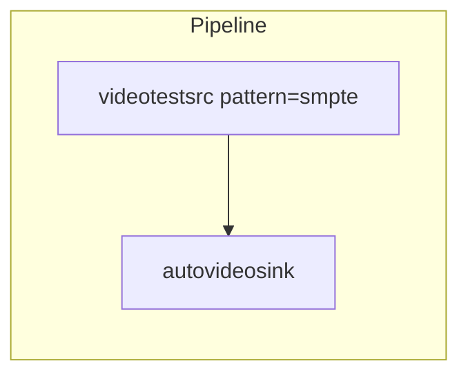

1. GStreamer 基础概念与 Rust 集成
- GStreamer 的核心概念（Element、Pad、Bin、Pipeline）
- Rust GStreamer 绑定介绍
- 基本的 Rust GStreamer 项目搭建
- 简单示例：播放本地视频文件

## Introduction

- Brief overview of multimedia streaming applications today
- Introduction to GStreamer as a solution for building streaming applications
- Why Rust is a great fit for GStreamer development
- What readers will learn from this article

Nowadays, streaming multimedia applications are wildly used. Video on demand like Netflix and YouTube; Live streaming like Twitch; Interactive Streaming like Zoom. GStreamer is a popular open-source multimedia framework, which makes it possible to write any type of streaming multimedia application.

One of the most famous product based on GStreamer is [NVIDIA DeepStream SDK](https://developer.nvidia.com/deepstream-sdk), which is a complete analytics toolkit for AI-based multi-sensor processing, video, audio, and image understanding.

The core idea of the GStreamer is pipeline. It provides the various plugins which can be easily linked and arrange to build any type of streaming multimedia application, not only video player, but also live streaming service, editing application.

The framework is developed based on C, but nowadays, we have *better* programming language for building low latency applicant: Rust. The official team of GStreamer maintains a project [gstreamer-rs](https://gitlab.freedesktop.org/gstreamer/gstreamer-rs), which is a comprehensive Rust bindings for GStreamer. Although the document of GStreamer is based on the C implementation, but the core team also provides Rust version for code in [tutorials](https://gitlab.freedesktop.org/gstreamer/gstreamer-rs/tree/main/tutorials) and many [examples](https://gitlab.freedesktop.org/gstreamer/gstreamer-rs/tree/main/examples). These will be a good reference when implementing our application or understanding the concept.

In this article, we will introduce the core concepts of GStreamer, includes Element, Pad, Bin, Pipeline based on Rust bindings. The official document also introduces these concepts, but we will give you more explanation and examples.

We will also show you an simplest Rust example which includes all concepts of this framework, and show you how to utilize the document and terminal tools to develop a real application.

For the development environment, I suggest using Linux, Arch would be the best choice because the great community, however, you can also use Ubuntu if you don’t like rolling updates. MacOS is also a good choice, but please make sure read the [document](https://gstreamer.freedesktop.org/download/#macos) before installing. After installing, you may also need to config the dynamic links for compiling the Rust project.

You can use any your favourite tools to write the code. The Rust team provides a great plugin for Rust development, therefore it’s smoothly to use Cursor, WindSurf or VSCode to develop it. RustRover is also a good choice if you’re familiar with JetBrains tools. If you’re using AI to assist your development, make sure you’re very clear about what you’re doing. Because we’re using the Rust binding instead of the original GStreamer framework in C, the open-source code isn’t be much. Compare with some popular field like React or Gin, AI will be more prone to make mistakes.

## hellosrc ! worldsink

We will start with a simple example which only contains an source element to provide stream data to pipeline and a sink element to receive and show the result to user.



The pipeline starts with a **source** element `videotestsrc` whose *pattern* is *smpte*. It produce a test video data, you can control the video pattern via `pattern` param.

And the pipeline ends with a **sink** element `autovideosink`. It is able to automatically find an appropriate video sink to use based on your system when the pipeline is built.

This is a pretty simple pipeline but can provide the core idea of the GStreamer pipeline design: Use a source element to load data, and use a sink element to feed data to user. In a real pipeline, we also have many element at between the source and sink to process the video / audio data. 

GStreamer proviode a terminal tool `gst-launch-1.0` to help you create a pipeline quickly. This is useful to test idea. You can run this pipeline via the following terminal command.

```bash
gst-launch-1.0 videotestsrc pattern=smpte ! autovideosink
```

After running this command, you will see SMPTE color bars.


Congratulations! 🎉 You have run your first GStreamer pipeline! It’s a good start, let‘s take a step further and discuss some of the core concepts of GStreamer.

## Understanding GStreamer’s Core Concepts

In a nutshell, the pipeline consists of multiple elements. Elements are connected to each other via pad on it. The media data generated by the source element, it’s processed by the elements in the pipeline in turn, such as decoding, encoding, and converting. Finally, the data stream will be received by the sink element. The sink element will use the processed media stream to play or do other things.

In development, you will encounter these concepts frequently. Especially element’s pads. We will introduce them to make sure you won’t be unfamiliar with these most basic concepts. And we will also show you how to get the information you need from the official resources.

### Elements

An Element is the basic block of GStreamer world. Basically, your daily work with GStreamer is choosing a series of elements and linking them together to build a pipeline for any specific task. GStreamer provides over 1600 elements distributes across approximately 230 plugins. These element encompass a wide range of functionalities, including codecs, filters, sources, sinks and various processing tools.

Introduction
Brief overview of multimedia streaming applications today
Introduction to GStreamer as a solution for building streaming applications
Why Rust is a great fit for GStreamer development
What readers will learn from this article
Nowadays, streaming multimedia applications are wildly used. Video on demand like Netflix and YouTube; Live streaming like Twitch; Interactive Streaming like Zoom. GStreamer is a popular open-source multimedia framework, which makes it possible to write any type of streaming multimedia application.
One of the most famous product based on GStreamer is NVIDIA DeepStream SDK, which is a complete analytics toolkit for AI-based multi-sensor processing, video, audio, and image understanding.
The core idea of the GStreamer is pipeline. It provides the various plugins which can be easily linked and arrange to build any type of streaming multimedia application, not only video player, but also live streaming service, editing application.
The framework is developed based on C, but nowadays, we have better programming language for building low latency applicant: Rust. The official team of GStreamer maintains a project gstreamer-rs, which is a comprehensive Rust bindings for GStreamer. Although the document of GStreamer is based on the C implementation, but the core team also provides Rust version for code in tutorials and many examples. These will be a good reference when implementing our application or understanding the concept.
In this article, we will introduce the core concepts of GStreamer, includes Element, Pad, Bin, Pipeline based on Rust bindings. The official document also introduces these concepts, but we will give you more explanation and examples.
We will also show you an simplest Rust example which includes all concepts of this framework, and show you how to utilize the document and terminal tools to develop a real application.
For the development environment, I suggest using Linux, Arch would be the best choice because the great community, however, you can also use Ubuntu if you don’t like rolling updates. MacOS is also a good choice, but please make sure read the document before installing. After installing, you may also need to config the dynamic links for compiling the Rust project.
You can use any your favourite tools to write the code. The Rust team provides a great plugin for Rust development, therefore it’s smoothly to use Cursor, WindSurf or VSCode to develop it. RustRover is also a good choice if you’re familiar with JetBrains tools. If you’re using AI to assist your development, make sure you’re very clear about what you’re doing. Because we’re using the Rust binding instead of the original GStreamer framework in C, the open-source code isn’t be much. Compare with some popular field like React or Gin, AI will be more prone to make mistakes.
hellosrc ! worldsink
We will start with a simple example which only contains an source element to provide stream data to pipeline and a sink element to receive and show the result to user.
Mermaid
预览
拷贝
标题
Pipeline

videotestsrc pattern=smpte

autovideosink

The pipeline starts with a source element videotestsrc whose pattern is smpte. It produce a test video data, you can control the video pattern via pattern param.
And the pipeline ends with a sink element autovideosink. It is able to automatically find an appropriate video sink to use based on your system when the pipeline is built.
This is a pretty simple pipeline but can provide the core idea of the GStreamer pipeline design: Use a source element to load data, and use a sink element to feed data to user. In a real pipeline, we also have many element at between the source and sink to process the video / audio data.
GStreamer proviode a terminal tool gst-launch-1.0 to help you create a pipeline quickly. This is useful to test idea. You can run this pipeline via the following terminal command.
Shell
拷贝
标题
gst-launch-1.0 videotestsrc pattern=smpte ! autovideosink

After running this command, you will see SMPTE color bars.

Congratulations!  You have run your first GStreamer pipeline! It’s a good start, let‘s take a step further and discuss some of the core concepts of GStreamer.
Understanding GStreamer’s Core Concepts
In a nutshell, the pipeline consists of multiple elements. Elements are connected to each other via pad on it. The media data generated by the source element, it’s processed by the elements in the pipeline in turn, such as decoding, encoding, and converting. Finally, the data stream will be received by the sink element. The sink element will use the processed media stream to play or do other things.
In development, you will encounter these concepts frequently. Especially element’s pads. We will introduce them to make sure you won’t be unfamiliar with these most basic concepts. And we will also show you how to get the information you need from the official resources.
Elements
An Element is the basic block of GSt

### Pads

Pads are an element’s **input** and **output**, where you can connect other elements. It’s crucial to choose the correct pad to handle the data flow because a pad has specific data handling capabilities, restrict the type of data that flows through it. You can only link two pads whose data types are compatible.

### gst-inspect-1.0

`gst-inspect-1.0` is a command-line utility that lets you get the briefly information about the GStreamer plugins and elements installed on your system. Suppose you’re going to build a pipeline which uses `videotestsrc` as the source element, you can use the following command in the terminal to get the basic information about this element quickly.

```bash
gst-inspect-1.0 videotestsrc
```

This will give you the basic meta data of the `videotestsrc`, includes object architecture, pad templates, element properties, etc. But if you want more details about this element, you can also search and read it in the [official document](https://gstreamer.freedesktop.org/documentation/videotestsrc/index.html?gi-language=c#videotestsrc-page).

## Advanced concepts

The core of programming lies in how to start with simple constructs and build complex systems through abstraction and composition. Now we have understand the simple block of the GStreamer world, now we can discuss how to build a complex pipeline based on this and how to work with it.

### Bins & Pipelines

A bin is a container for a collection of elements. In a complex GStreamer pipeline, you may want to reuse or control some elements as if it were an element. Bin is designed to address this issue.

A Pipeline is a top-level bin. It holds the entire system and manage the synchronization for its children. You can set the state to pause or playing via API, all elements will be processed through a series of operations.

And this is how we build a complex pipeline.

### Bus

If we integrate the pipeline into our system, it’s important to receive and handle the event thrown from the pipeline. For example, show the UI changes when the pipeline starts playing the video.

A message bus is a communication mechanism that enables different components or threads within a system to exchange messages. These components can communicate with each other without knowing the details of each other’s implementation.

In our scenario that using GStreamer to develop a media streaming application, the message bus is a important model provided by GStreamer which allows elements to cmmunicate async messages, like errors, state changes, or end-of-stream notifications, to the application. The bus system is built on top of GLib’s event loop and messaging infrastructure. It’s a general-purpose utility library written in C, originally developed for building graphical user interface. In the most of the time, you don’t need to use the API provided by GLib directly, but it’s still worth to know this so that have thought when you encounter some issues.

The `bus` is from the pipeline instance, you can receive a message streaming by calling `iter_timed`. By the way, this is not the only API to get the message streaming, you can choose the appropriated API according to your requirements.

## A complete example

Here is an example from [official repository](https://gitlab.freedesktop.org/gstreamer/gstreamer-rs/-/blob/main/tutorials/src/bin/basic-tutorial-1.rs). I deleted some code so that we can focus on the main topic. If you’re using Linux, you can run this code directly, but on the macOS, you need some setup before run the code. You can clone the tutorials code from the [gitlab repository](https://gitlab.freedesktop.org/gstreamer/gstreamer-rs/-/tree/main/tutorials).

```rust
use gst::prelude::*;

fn tutorial_main() {
    // Initialize GStreamer
    gst::init().unwrap();

    // Create the elements
    let source = gst::ElementFactory::make("videotestsrc")
        .name("source")
        .property_from_str("pattern", "smpte")
        .build()
        .expect("Could not create source element.");
    let sink = gst::ElementFactory::make("autovideosink")
        .name("sink")
        .build()
        .expect("Could not create sink element");

    // Create the empty pipeline
    let pipeline = gst::Pipeline::with_name("test-pipeline");

    // Build the pipeline
    pipeline.add_many([&source, &sink]).unwrap();
    source.link(&sink).expect("Elements could not be linked.");

    // Start playing
    pipeline
        .set_state(gst::State::Playing)
        .expect("Unable to set the pipeline to the `Playing` state");

    // Wait until error or EOS
    let bus = pipeline.bus().unwrap();
    for msg in bus.iter_timed(gst::ClockTime::NONE) {
        use gst::MessageView;

        match msg.view() {
            MessageView::Error(err) => {
                eprintln!(
                    "Error received from element {:?}: {}",
                    err.src().map(|s| s.path_string()),
                    err.error()
                );
                eprintln!("Debugging information: {:?}", err.debug());
                break;
            }
            MessageView::Eos(..) => break,
            _ => (),
        }
    }

    pipeline
        .set_state(gst::State::Null)
        .expect("Unable to set the pipeline to the `Null` state");
}

```

Now, let’s go through the whole function.

First, initialize the GStreamer via `gst::init()`. This is necessary for any GStreamer programs.

Second, create the elements we need for the pipeline. In this example, we will only use two elements. `videotestsrc` is a simple source element for testing, you don’t need to prepare the videofile by yourself. `autovideosink` can detects an appropriate video sink based on your system to use.

You can create an element via `gst::ElementFactory::make('element_name')`. After setting some necessary properties, you can call `.build()` to built the element. For the property and its values, you can find them in the document. But because we’re using the Rust bindings, therefore we can’t use the enum from C. We need to use `property`, `property_from_str` or other methods to assign the value. Use the literal string or magic number is not a good practice in the programming, but you can encapsulate them in your personal defined enum in Rust.

Third, create a pipeline, and add all elements and link them. Sometime it’s maybe complex to link two elements, especially when the element has different pad. You may need to write code to detect the signal passed from upstream element on the runtime and connect them to appropriate sink pad of next element. But for the first article, we will skip this. And especially the `videotestsrc` and `autovideosink` can handle the connection automatically.

Fourth, setup listener of message bus. Receive message from `iter_itmed` on `bus`. Here is the signature of the function:

```rust
pub fn iter_timed(&self, timeout: impl Into<Option<ClockTime>>) -> Iter<'_>
```

In the loop on `Iter<’_>`, use patter matching to handle all event you’re interested in.

Finally, when an error or Eos event received, shutdown the whole pipeline.

TODO. add something about use terminal command to test your pipeline design first.

## hellosrc ! worldsink

In a nutshell, the application based on GStreamer is a **pipeline**, which consists of **Elements**. Each Element has its input and output, which named **Pad**. The pipeline use ***source** element (these elements always end with *src)* to load data, use a series intermediate elements to process the media flow, and use ***sink** element (these elements always end with *sink)* to output processed result. 

Here is any basic example pipeline of video processing. You can run it in your terminal, make sure replace the location to your real video file location. If you need any sample videos, audio or any other media file for development or quick testing, you can download it from this [website](https://www.sample-videos.com/).

```bash
gst-launch-1.0 filesrc location=SampleVideo_1280x720_2mb.mp4 ! \
    qtdemux name=demux \
    demux.video_0 ! queue ! h264parse ! avdec_h264 ! videoconvert ! autovideosink \
    demux.audio_0 ! queue ! aacparse ! avdec_aac ! audioconvert ! autoaudiosink
```

At the same time, you can also refer to this diagram to understand the whole structure of the pipeline.

```mermaid
graph LR
    filesrc[filesrc location=SampleVideo_1280x720_2mb.mp4] --> qtdemux[qtdemux  name=demux]
    
    %% Video process path
    qtdemux --> |demux.video_0| queue1[queue]
    queue1 --> h264parse[h264parse] 
    h264parse --> avdec_h264[avdec_h264]
    avdec_h264 --> videoconvert[videoconvert]
    videoconvert --> autovideosink[autovideosink]
    
    %% Audio process path
    qtdemux --> |demux.audio_0| queue2[queue]
    queue2 --> aacparse[aacparse]
    aacparse --> avdec_aac[avdec_aac]
    avdec_aac --> audioconvert[audioconvert]
    audioconvert --> autoaudiosink[autoaudiosink]
    
    classDef source fill:#f9d77e,stroke:#333,stroke-width:1px
    classDef demuxer fill:#a2d2ff,stroke:#333,stroke-width:1px
    classDef parser fill:#bde0fe,stroke:#333,stroke-width:1px
    classDef decoder fill:#ffc8dd,stroke:#333,stroke-width:1px
    classDef converter fill:#cdb4db,stroke:#333,stroke-width:1px
    classDef sink fill:#ffafcc,stroke:#333,stroke-width:1px
    classDef queue fill:#d0f4de,stroke:#333,stroke-width:1px
    
    class filesrc source
    class qtdemux demuxer
    class h264parse,aacparse parser
    class avdec_h264,avdec_aac decoder
    class videoconvert,audioconvert converter
    class autovideosink,autoaudiosink sink
    class queue1,queue2 queue
```



The pipeline start with a `filesrc`, it load data from the provided file via standard I/O. It’s a simple element, only load data and output the original binary data stream to downstream element. It also support random accessing and creating buffer.

The second element is a demuxer. The responsibility of it is to split a container file with multiple media streams into separate elementary streams. `qtdemux` is one popular demuxer designed for processing QuickTime structure container format. MOV, MP4, and 3GP are both belongs to this family. And that’s why you can see two processing branches after the `qtdemux`, the one is the video processing and another is audio processing. Those branch can get the stream they want from the pad of `qtdemux`, for example, `audio_%u` and `video_%u`. Additional, it can also output subtitle stream, but we just skip it in this example so that we can focus on the important major topic. You can get more details about this element from [document](https://gstreamer.freedesktop.org/documentation/isomp4/qtdemux.html?gi-language=c#qtdemux-page).

After the demuxer, there are two separated processing branch: video and audio. All of them are start with `queue`. This is a crucial component that serves two primary purposes:

1. Create a thread boundary. It means downstream of the queue can operate in a separate thread from those upstream.
2. Providing buffering capability. It temporarily stores incoming data until it can be processed by downstream elements.

These features are essential for managing scenarios where different parts of the pipeline may process data at varying rates, thus preventing data starvation or overflow.

For the video branch, we use `h264parse` to parse H.264 encoded streams, the `avdec_h264` takes output from upstream and decodes it into raw video frames. `videoconvert` converts video frames into suitable formats and color spaces. Finally, `autovideosink` selects an appropriate video sink based on the capabilities of available sinks on the OS.

For the audio branch, the idea is similar. `accparse` is an AAC parser that handles both ADIF and ADTS stream formats. `avdev_acc`, which provided by the libav library, takes output from `accparse` and decodes it into raw audio data. `audioconvert` element converts raw audio buffers between various possible formats. Finally, `autoaudiosink` element automatically detects an appropriate audio sink to use.

Based on the processing we mentioned above, you will see the video and audio playing on your computer.

You can try this pipeline in the terminal via this command:

```bash
gst-launch-1.0 filesrc location=SampleVideo_1280x720_2mb.mp4 ! \
    qtdemux name=demux \
    demux.video_0 ! queue ! h264parse ! avdec_h264 ! videoconvert ! \
    warptv ! videobalance saturation=1.2 ! \
    autovideosink \
    demux.audio_0 ! queue ! aacparse ! avdec_aac ! audioconvert ! \
    volume volume=1.5 ! \
    autoaudiosink
```

```bash
gst-launch-1.0 filesrc location=SampleVideo_1280x720_2mb.mp4 ! \
    qtdemux name=demux \
    demux.video_0 ! queue ! h264parse ! avdec_h264 ! videoconvert ! \
    warptv ! videobalance saturation=1.5 brightness=0.1 contrast=1.2 hue=0.1 ! \
    autovideosink \
    demux.audio_0 ! queue ! aacparse ! avdec_aac ! audioconvert ! \
    audioecho delay=50000000 intensity=0.3 feedback=0.2 ! \
    equalizer-3bands band0=3.0 band1=2.0 band2=4.0 ! \
    audioamplify amplification=1.2 ! \
    audiopanorama panorama=0.3 ! \
    autoaudiosink
```

```bash
gst-launch-1.0 filesrc location=SampleVideo_1280x720_2mb.mp4 ! \
   qtdemux name=demux \
   demux.video_0 ! queue ! h264parse ! avdec_h264 ! videoconvert ! \
   autovideosink \
   demux.audio_0 ! queue ! aacparse ! avdec_aac ! audioconvert ! \
   audiocheblimit mode=low-pass cutoff=8000 ! \
   audioecho delay=200000000 intensity=0.6 feedback=0.4 ! \
   pitch pitch=0.8 ! \
   audioamplify amplification=1.5 ! \
   audiowsincband lower-frequency=100 upper-frequency=4000 ! \
   audiopanorama panorama=-0.3 ! \
   volume volume=2.0 ! \
   autoaudiosink
```
