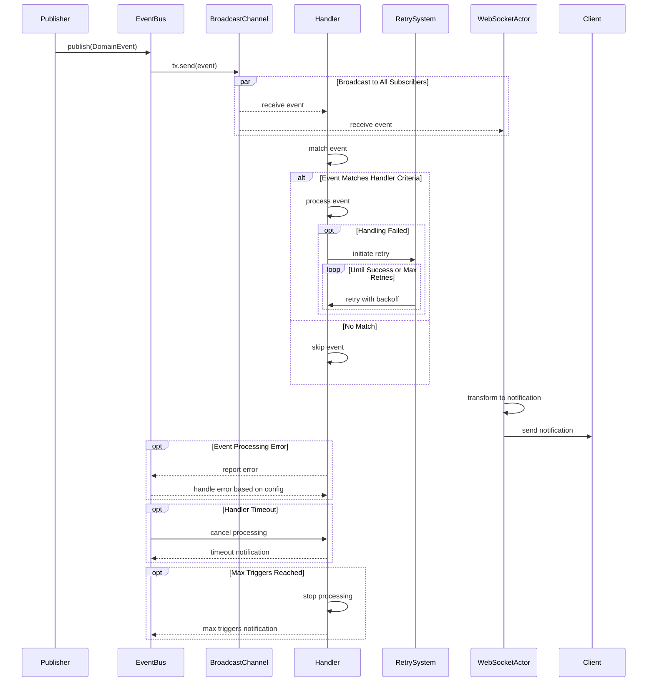

> Writing is research and development for your brain.

I'm not a big fan of writing.
At least, my grades in writing are not good in high school. At that time, I need to spend most of the time on Math, Physical and English. It's a good strategy, especially for people with low grades.

After I graduated from high school, I realized that I need to read some more humanistic books.
The first writer I met was Murakami Haruki. He is a Japanese writer.
And some fun thing is, he is famous for his fiction, but I prefer his varia. As the words were saying, his varia is the most delicious oolong tea in Japan. And thanks to him, I begin to read, start to listen to Jazz.
All things are difficult before they are easy. After that, it all fell into place.

So, after reading, I want to write some things. And another thing is, I graduated from college. I realized I don't like my profession, so I decided to give up four years of experience on **material** and switch to **programming**.

That's a long story. Maybe I can write a blog to say more detail in the future.
Initially, I want to write fiction. But it's complicated work. I tried to read many handbooks about it, but I can't write anything.

Later, I realized that I could write some blog to record the experience or ideas about programming. So, I created a [blog website](https://www.bebopser.com/) by using **Hexo**. It's a great tool but hard to use for me at that time.
Since I know a few things about programming, primarily front-end.
But, after addressing many many issues, I make it live successfully. I wrote 50 blogs a year, and it helps me get my current company's offer.👏

Everything is good, except the **Hexo** and my server.
I can't find a simple but has enough functionality theme. Many themes have excellent animation effects but have huge JavaScript files, resulting in unbearable render time.
And I deployed the blog on the Github page, and I also applied for a new domain name for my blog.

I want to migrate to a new system, and I don't want to take much time on deployment stuff. So I tried to find a new system which can suit my requirements.

So, what you see now, is my result.

---

By the way, I will use this page to test Mermaid and MathJax.



The famous formula is $E=mc^2$.

Here are multiple lines:

```math
\begin{align*}
\sum_{n=1}^{\infty} \frac{1}{n^2} &= \frac{\pi^2}{6} \\
\int_{0}^{\infty} \frac{\sin(x)}{x} \, dx &= \frac{\pi}{2} \\
\int_{-\infty}^{\infty} e^{-x^2} \, dx &= \sqrt{\pi}
\end{align*}
```
