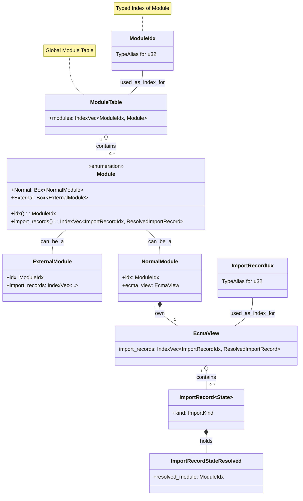

## Introduction

Rolldown is a high-performance JavaScript bundler written in Rust. While offering full compatibility with the Rollup API, it achieves bundling speeds 10 to 30 times greater. Driven by the need for a single, unified engine for both development and production, the Vite team is developing Rolldown to be the successor to its current bundler stack of esbuild and Rollup.

In a modern front-end project, hundreds or even thousands of modules form an intricate dependency graph. A bundler's understanding cannot be limited to simple file-level imports; it must go deeper to determine if the `useState` imported in `featureA.js` is the very same entity as the one in `featureB.js`. This crucial resolution process is known as **linking**.

The link stage is designed to solve this puzzle. It addresses macro-level properties that propagate through the module graph, like the contagious nature of top-level await; it builds a communication bridge between different module system (CJS/ESM); and ultimately, it traces every imported symbol back to its unique, original definition.

To demysify this process, we will use a three-level mental model to unveil the inner workings of the link stage, exploring it step-by-step from a macro to a micro perspective.

## Three-level mental model

The output of the scan stage is a rudimentary module dependency graph, but its scope is limited to the file level. The link stage, in contrast, employs a series of data structures and algorithms to refine this graph, untimately generating a precise, symbol-level dependency map.

- **Foundation & inherent properties**. The scan stage provides the initial graph, stored in the `ModuleTable`, which captures all module dependency relationships. A depth-first traversal is then performed on this graph to calculate and propagate _contagious_ properties like top-level await (TLA). These properties can impact entire chains of modules through indirect dependencies, making this analysis a crucial prerequisite for the code generation stage.

- **Standardization & module communication protocol**. JavaScript's support for multiple module systems, primarily CommonJS (CJS) and ES Modules (ESM), introduces complexity. Before the core linking logic can execute, it is vital to normalize these different formats and handle details like namespace objects or shimmed exports. This standardization creates a uniform environment, allowing the symbol-linking algorithm to focus purely on its resolution logic instead of numerous edge cases.

- **Connecting everything: symbol genealogy**. At the most granular level, this stage connects symbols between their respective import and export statements. It utilizes the Disjoint Set Union (DSU) data structure to efficiently establish cross-module equivalence, ensuring that every symbol resolves to a single, unambiguous origin.

## Example project

To navigate the complex data structures and algorithms of the link stage, we will use a concrete example project. This approach will help make the underlying logic more tangible. The project is intentionally designed to showcase serveral critical features that the link stage must handle:

- CJS & ESM mixed usage
- Top-level await
- Named exports and star re-exports
- Potentially ambiguous symbols
- External dependencies
- Side effects

The complete source code is available in this [GitHub Gist](https://gist.github.com/ShroXd/627bdf547fd7b9582876906ec3a114e1), and the file structure is as follows:

```plain
📁 .
├── api.js                # (1) Fetches data, uses Top-Level Await (ESM)
├── helpers.js            # (2) Re-exports modules, creating linking complexity (ESM)
├── legacy-formatter.cjs  # (3) An old formatting utility (CJS)
├── main.js               # (4) The application entry point (ESM)
└── polyfill.js           # (5) A simulated polyfill to demonstrate side effects (ESM)
```

To run this example yourself, place these files in the `crates/rolldown/examples/basic` directory of the Rolldown codebase. Then, modify the `basic.rs` file to use `main.js` as the entry point:

```rust
// ...
input: Some(vec![
  "./main.js".to_string().into(),
]),
```

With the debug environment configured, you are encouraged to run the bundler with breakpoints. Stepping through the execution and inspecting the data structures in real-time is an excellent way to gain a deeper understanding of the process.

## Foundation & inherent properties

The scan stage produces a foundational module dependency graph. In this directed graph, nodes represent individual modules, and edges denote the import relationships between them. This structure is typically implemented using an adjacency list for efficient traversal. The primary task in this foundational phase of linking is to traverse this graph and compute macro-level properties -- such as the contagious nature of top-level await (TLA) -- that propagate throughout an import chain. A solid grasp of the core module data structures is essential to understanding how these algorithms operate.

### Graph design

At the core of the graph's design is the `ModuleIdx`, a typed index used to refer to a specific module. Modules are categorized into two types, `NormalModule` and `ExternalModule`, though our analysis will primarily focus on the former. Each `NormalModule` encapsulates the result of its ECMAScript parsing, most notably including an `import_records` field that lists all of its import statements. The following calss diagram illustrates this data structure design.


