## Introduction

Rolldown is a high-performance JavaScript bundler written in Rust. While offering full compatibility with the Rollup API, it achieves bundling speeds 10 to 30 times greater. Driven by the need for a single, unified engine for both development and production, the Vite team is developing Rolldown to be the successor to its current bundler stack of esbuild and Rollup.

In a modern front-end project, hundreds or even thousands of modules form an intricate dependency graph. A bundler's understanding cannot be limited to simple file-level imports; it must go deeper to determine if the `useState` imported in `featureA.js` is the very same entity as the one in `featureB.js`. This crucial resolution process is known as **linking**.

The link stage is designed to solve this puzzle. It addresses macro-level properties that propagate through the module graph, like the contagious nature of top-level await; it builds a communication bridge between different module system (CJS/ESM); and ultimately, it traces every imported symbol back to its unique, original definition.

To demysify this process, we will use a three-level mental model to unveil the inner workings of the link stage, exploring it step-by-step from a macro to a micro perspective.

## Three-level mental model

The output of the scan stage is a rudimentary module dependency graph, but its scope is limited to the file level. The link stage, in contrast, employs a series of data structures and algorithms to refine this graph, untimately generating a precise, symbol-level dependency map.

- **Foundation & inherent properties**. The scan stage provides the initial graph, stored in the `ModuleTable`, which captures all module dependency relationships. A depth-first traversal is then performed on this graph to calculate and propagate _contagious_ properties like top-level await (TLA). These properties can impact entire chains of modules through indirect dependencies, making this analysis a crucial prerequisite for the code generation stage.

- **Standardization & module communication protocol**. JavaScript's support for multiple module systems, primarily CommonJS (CJS) and ES Modules (ESM), introduces complexity. Before the core linking logic can execute, it is vital to normalize these different formats and handle details like namespace objects or shimmed exports. This standardization creates a uniform environment, allowing the symbol-linking algorithm to focus purely on its resolution logic instead of numerous edge cases.

- **Connecting everything: symbol genealogy**. At the most granular level, this stage connects symbols between their respective import and export statements. It utilizes the Disjoint Set Union (DSU) data structure to efficiently establish cross-module equivalence, ensuring that every symbol resolves to a single, unambiguous origin.

## Example project

To navigate the complex data structures and algorithms of the link stage, we will use a concrete example project. This approach will help make the underlying logic more tangible. The project is intentionally designed to showcase serveral critical features that the link stage must handle:

- CJS & ESM mixed usage
- Top-level await
- Named exports and star re-exports
- Potentially ambiguous symbols
- External dependencies
- Side effects

The complete source code is available in this [GitHub Gist](https://gist.github.com/ShroXd/627bdf547fd7b9582876906ec3a114e1), and the file structure is as follows:

```plain
📁 .
├── api.js                # (1) Fetches data, uses Top-Level Await (ESM)
├── helpers.js            # (2) Re-exports modules, creating linking complexity (ESM)
├── legacy-formatter.cjs  # (3) An old formatting utility (CJS)
├── main.js               # (4) The application entry point (ESM)
└── polyfill.js           # (5) A simulated polyfill to demonstrate side effects (ESM)
```

To run this example yourself, place these files in the `crates/rolldown/examples/basic` directory of the Rolldown codebase. Then, modify the `basic.rs` file to use `main.js` as the entry point:

```rust
// ...
input: Some(vec![
  "./main.js".to_string().into(),
]),
```

With the debug environment configured, you are encouraged to run the bundler with breakpoints. Stepping through the execution and inspecting the data structures in real-time is an excellent way to gain a deeper understanding of the process.

## Foundation & inherent properties

The scan stage produces a foundational module dependency graph. In this directed graph, nodes represent individual modules, and edges denote the import relationships between them. This structure is typically implemented using an adjacency list for efficient traversal. The primary task in this foundational phase of linking is to traverse this graph and compute macro-level properties -- such as the contagious nature of top-level await (TLA) -- that propagate throughout an import chain. A solid grasp of the core module data structures is essential to understanding how these algorithms operate.

### Graph design

At the core of the graph's design is the `ModuleIdx`, a typed index used to refer to a specific module. Modules are categorized into two types, `NormalModule` and `ExternalModule`, though our analysis will primarily focus on the former. Each `NormalModule` encapsulates the result of its ECMAScript parsing, most notably including an `import_records` field that lists all of its import statements. The following calss diagram illustrates this data structure design.


Traversing the dependency graph requires iterating through each module's dependencies. These are accessed via the `import_records` field. To facilitate this common operation, the `Module` enum implements a convenient `import_records()` accessor method. This design choice simplifies graph traversal, as demonstrated by the following common code pattern in the Rolldown source:

```rust
module_table.modules[module_idx]
	.import_records()
	.iter()
	.map(|rec| {
	  // do something...
	})
```

### Major data structure: `LinkingMetadata`

The final output of the link stage is encapsulated within the `LinkStageOutput` struct. Its defination is as follows:

```rust
pub struct LinkStageOutput {
  pub module_table: ModuleTable,
  pub metas: LinkingMetadataVec,
  pub symbol_db: SymbolRefDb,
  // ...
}
```

To summarize the roles of these fields: `ModuleTable` is the primary input from the scan stage, while `LinkingMetadataVec` and `SymbolRefDb` are the key outputs, storing newly computed information at the module and symbol levels, respectively. Collectively, these three structures provide a complete, multi-layered description of the module dependencies, from a macro to a micro perspective.

Similar to `ModuleTable`, `LinkingMetadataVec` is an indexed vector that uses a `ModuleIdx` to access the metadata for each specific module. It is within the `LinkingMetadata` struct itself that most of this new module-level information is recorded.


### Computing TLA

Top-level await (TLA), as the name implies, allows developers to use the `await` keyword at the top level of an ES Module, removing the need to wrap asynchronous code in an `async` function. Thes feature greatly simplifies asynchronous initialization tasks, offering clearer code than the traditional Immediately Invoked Function Expression (IIFE) pattern. Our example project's `api.js` file demostrates this:

```javascript
console.log('API module evaluation starts.')
// Use top-level await to make the entire dependency chain async
const response = await fetch('https://api.example.com/items/1')
const item = await response.json()

// Export a processed data
export const fetchedItem = { id: item.id, value: item.value * 100 }

// Export a normal variable, we will use it to create confusion
export const source = 'API'

console.log('API module evaluation finished.')
```

A key characteristic of TLA is its contagious nature. If a module uses TLA, any other module that directly or indirectly imports it is also affected and must be treated as asynchronous. This state is tracked by the `is_tla_or_contains_tla_dependency` flag within each module's `LinkingMetadata`. In our example, `main.js` depends on `helpers.js`, which in turn depends on the TLA-using `api.js`. Consequently, Rolldown performs a depth-first traversal of the graph and sets this flag to `true` for all three modules.

The logic for computing this flag follows naturally from TLA's behavior. Rolldown employs a recursive depth-first search (DFS) algorithm, using a hash map for memoization to prevent redundant computations on the same module. The core of the algorithm determines if a module is _TLA-affected_ by checking two conditions:

- Does the module itself contains a top-level `await`? (This is known from the `ast_usage` field computed during the scan stage)
- Does the module import any other module taht is, itself, TLA-affected?

This recursive check ensures that the _contagious_ property is correctly propagated up the entire dependency chain from its origin.

### Determining side effects

In simple terms, a module is said to have side effects if, upon being imported, it does more than just export variables, functions, or classes. Specifically, it executes code that affects the global environment or modifies objects outside its own scope. Polyfills are a classic application, as they often augment global objects to allow new APIs to be used in outdated browsers.

Our example project's `polyfill.js` is a perfect illustration. Although `main.js` imports it via `import './polyfill.js'` without referencing any symbols, the module is stll considered to have side effects because it modifies the global `globalThis` object. Therefore, Rolldown must ensure this module's code is included in the final bundle.

Since bundlers cannot programmatically determine if a side effect is beneficaial, they must conservatively preserve any module marked as having them. The process for identifying these modules is analogous to computing TLA, as this property is also contagious. If a module has side effects, any module that imports it (directly or indirectly) is also considered to be affected. The underlying algorithm is therefore similar: a recursive depth-first searhc (DFS) that inspects the `side_effects()` information on each `Module`, with memoization to avoid redundant checks.

Our module graph is now labeled with macro-attributes such as top-level await and side effects. However, this is not yet sufficient. Before we can precisely link symbols, we must first address the fact that modules can use different system (like CJS and ESM). They need a common communication protocol. This is the goal of our next step.

## Standardization & module communication protocol

While the scan stage has already mapped out the module dependency graph, it only captures file-level relationships. This raw graph does not account for the fact that modules may use different systems -- such as CommonJS (CJS) and ES Modules (ESM) -- which are not inherently interoperable. To bridge this gap, a standardization process is required before any deeper linking logic can be applied.

This standardization aoccurs during the link stage. Rolldown iterates over the module graph, computes the necessary normalization information for each module, and records it in the corresponding `LinkingMetadata` struct. This struct, as we've noted, is held within the `metas` field of the `LinkStageOutput`.

### Module systems & wrappers

Modern JavaScript is dominated by two mainstream module systems: CommonJS (CJS) and ES Modules (ESM).

- **CommonJS (CJS)**: Primarilly used in the Node.js ecosystem, CJS is a synchronous system. Dependencies are loaded via a blocking `require()` call, and modules expose their API by assigning to the `module.exports` or `exports` objects.

- **ES Modules (ESM)**: The official standard introduced by ECMAScript, designed for both browsers and Node.js. Its static structure (using `import` and `export` statements) is designed for compile-time analysis, while the browser loading mechanism itself is **asynchronous** and non-blocking.

These two systems are often used interchangeably within a single codebase, especially when modern ESM-based projects rely on older third-party libraries that only provide a CJS distribution. To handle this mixed usage, Rolldown determines when a module needs a **wrapper**. While the specific algorithms will be detailed later, the concept is straightforwar: a wrapper is a function closure that emulates a specific module environment, allowing incompatible systems to communicate.

This simplified example below illustrates this core idea:

```javascript
// Code storage
const __modules = {
  './utils.js': exports => {
    exports.add = (a, b) => a + b
  },
  './data.js': (exports, module) => {
    module.exports = { value: 42 }
  },
}

// Runtime
function __require(moduleId) {
  const module = { exports: {} }
  __modules[moduleId](module.exports, module)

  return module.exports
}
```

While the actually generated code is more complex, the fundamental principle is the same: wrap a module's code in a function to provide the necessary environment at runtime. This is precisely what happens with `legacy-formatter.cjs` in our example project. Rolldown detects that this CJS file is imported by an ESM module (`helpers.js`) and wraps it accordingly (using `WrapKind::Cjs`). This wrapper emulates the `module.exports` environment, ensuring seamless interoperability. You can inspect the bundled output in the `basic/dist` folder to see this in action.

### Determining module kind and wrappers

To ensure seamless interoperability between CJS and ESM, Rolldown must select the correct _wrapper_ for each module. This decision depends not just on the module's own format, but also on _how_ it is being imported by other modules.

First, the `ExportsKind` of each module is identified during the scan stage based on its syntax and stored in its `EcmaView`:

```rust
pub struct EcmaView {
  pub exports_kind: ExportsKind,
  // ...
}
```

Next, Rolldown considers the `ImportKind` used by the importing module. This enum covers all the ways JavaScript can reference another file:

```rust
pub enum ImportKind {
  /// import foo from 'foo'
  Import,
  /// `import('foo')`
  DynamicImport,
  /// `require('foo')`
  Require,
  // ... (other kinds like AtImport, UrlImport, etc.)
}

pub enum ExportsKind {
  Esm,
  CommonJs,
  None,
}
```

The crucial logic lies in the **combination** of the importer's `ImportKind` and the importee's `ExportsKind`. This interaction dicates the `WrapKind` needed for the importee. For instance, when a module is loaded via `requre()` (an `ImportKind::Require`), its `WrapKind` is determined by its own `ExportsKind`. This logic ensures the correct runtime environment is provided for the module being imported.

```rust
// ...
ImportKind::Require => match importee.exports_kind {
  ExportsKind::Esm => {
    self.metas[importee.idx].wrap_kind = WrapKind::Esm;
  }
  ExportsKind::CommonJs => {
    self.metas[importee.idx].wrap_kind = WrapKind::Cjs;
  }
}
// ...
```

### Applying wrappers recursively

With the necessary `WrapKind` for various interactions determined, the `wrap_modules` function traverses the module graph to apply these wrappers and handle related complexities.

A key complexity is a star export (`export * from './dep'`) from a CommonJS module. Since the full list of exports from CJS cannot be known at compile-time, these are treated as dynamic exports, requiring special handling.

Furthermore, the wrapping process iteself is recursive. When a module requires a wrapper (e.g., a CJS module imported by an ESM one), it's not enough to wrap that single module. The wrapper might introduce new asynchronous behavior. Therefore, Rolldown must recursively traverse _up_ the import chain, ensuring that any module depending on the newly wrapped on is also handled correctly. This recursive propagation guarantees that dependencies are ready at runtime and preserves the correct execution order.

## Connecting everything: symbol genealogy

After establishing the graph's foundational properties and standardizing the module formats, we arrive at the core task of the link stage: processing imported symbols. The ultimate goal is to trace every symbol back to its single, unambiguous, original definition.

Consider this scenario from our example project: `main.js` imports a symbol named `source` from `helpers.js`, which in turn re-exports everything from `api.js`. How does the bundler prove that the `source` used in `main.js` is the _exact same_ variable defined in `api.js`?

This fundamentally a question of **equivalence**. To sovle this efficiently, Rolldown employs the Disjoin Set Union (DSU) data structure, an algorithm specifically designed for thsi class of problem. In this model, each symbol reference is treated as an element, and the goal is to group all references that point to the same original definition into a single, unified set.

### Disjoint set union

Disjoint Set Union (DSU), also known as a union-find data structure, is an efficient data structure where each set is represented as a tree. The root of the tree serves as the canonical representative for the set. DSU primarily supports two operations:

- **Find**: determine the canonical representative of the set to which a particular element belongs.
- **Union**: Merges two disjoint sets into a single set.

A classic DSU implementation uses a simple array, let's call it `parent`, where `parent[i]` stores the parent of element `i`. If `parent[i] == i`, then `i` is the root of its tree. The following pseudocode shows a basic implementation without optimizations.

```python
parent = []

def find(x):
	return x if parent[x] == x else find(parent[x])

def union(x, y):
	root_x = find(x)
	root_y = find(y)
	if root_x != root_y:
		# Link the root of x's tree to the root of y's tree
		parent[root_x] = root_y
```

Rolldown employs the same core idea but in a more robust and type-safe manner. Instead of a raw array, it uses an `IndexVec`, a vector-like structure indexed by typed IDs like `SymbolId`. The role of the parent pointer is fulfilled by the `link` field within the `SymbolRefDataClassic` struct, as shown in the diagram below.


As the diagram shows, each symbol's equivalence information is stored in `SymbolRefDataClassic`. The optional `link` field points to a parent symbol, which is directly analogous to the `parent` array in the classic implementation.

Rolldown implements the two primary DSU operations as `find_mut` and `link`.

#### The `find_mut` method (find with path compression)

Rolldown's `find_mut` method does more than just find the root; it also performs a crucial optimization known as **path compression**.

```rust
pub fn find_mut(&mut self, target: SymbolRef) -> SymbolRef {
  let mut canonical = target;
  while let Some(parent) = self.get_mut(canonical).link {
    // Path compression: Point the current node to its grandparent
    self.get_mut(canonical).link = self.get_mut(parent).link;
    canonical = parent;
  }
  canonical
}
```

As the `while` loop traverses up the tree toward the root (the element whose `link` is `None`), it re-links each visited node to point directly to its grandparent (self.get_mut(parent).link). This efficiently flattens the tree structure, dramatically speeding up future `find` operations for any node in that path. The final `canonical` symbol returned is the root representative of the set.

#### The `link` method (union)

The `link` method implements the `union` operation.

```rust
/// Make `base` point to `target`
pub fn link(&mut self, base: SymbolRef, target: SymbolRef) {
  let base_root = self.find_mut(base);
  let target_root = self.find_mut(target);
  if base_root == target_root {
    // Already linked
    return;
  }
  self.get_mut(base_root).link = Some(target_root);
}
```

It first finds the root representatives for both the `base` and `target` symbols. If the roots are identical, the symbols are already in the same set, and nothing needs to be done. Otherwise, it merges the two sets by setting the `link` of the `base`'s root to point to the `target`'s root.

### Bind imports and exports

The process of resolving symbols begins with the `bind_imports_and_exports` function. The initial step is to traverse all modules and extract their explicit named exports. These are stored in a hash map where keys are the exported string names and values are `ResolvedExport` structs.

```rust
pub struct ResolvedExport {
  pub symbol_ref: SymbolRef,
  pub potentially_ambiguous_symbol_refs: Option<Vec<SymbolRef>>,
}
```

However, this process is complicated by ES Module's star exports (`export * from './dep'`), which re-export all names from another module. Our `helpers.js` file uses this syntax: `export * from '.api.js'`.

Star exports can introduce ambiguity that must be resolved before the final inking. Therefore, for any module containing them, Rolldown invokes a dedicated function, `add_exports_for_export_star`. This function uses a recursive depth-first search (DFS) to traverse the dependency graph of star exports. To detect cycles and manage export precedence, it uses a `module_stack` in a classic backtracking pattern: a module's ID is pushed onto the stack before a recursive call and popped off after it returns.

This recursive traversal has two primary responsibilities:

- **Shadowing**: explicit named exports within a module always taks precedence. They will _shadow_ any same-named export that might be imported via a star export from a deeper dependency. The `module_stack` helps determine this precedence based on proximity in the import chain.

- **Ambiguity detection**: ambiguity arises when a module attempts to export the same name from multiple, distinct sources at teh same level of precedence (e.g., via two different star exports: `export * from 'a'` and `export * from 'b'`). If an incoming star-exported symbol has the same name as an existing one but is not shadowed, it is recorded in the `potentially_ambiguous_symbol_refs` field for later resolution.

Throughout this process, the function manipulates a single, mutable `resolve_exports FxHashMap` that is passed in from the caller, progressively building up the complete set of resolved exports for the module.

### Match imports with exports

With all module exports resolved, the next step is to match each import to its correspondig export. This entire precess is managed using the data and structures encapsulated within the `BindImportsAndExportsContext`.

```rust
struct BindImportsAndExportsContext<'a> {
  pub index_modules: &'a IndexModules,
  pub metas: &'a mut LinkingMetadataVec,
  pub symbol_db: &'a mut SymbolRefDb,
  pub external_import_binding_merger:
    FxHashMap<ModuleIdx, FxHashMap<CompactStr, IndexSet<SymbolRef>>>,
  // ... fields omitted for brevity
}
```

The ultimate goal here is to populate the `symbol_db`, using the Disjoint Set Union logic to link each imported symbol to its true origin. The process iterates through each `NormalModule` and runs a matching function on its named imports (each represented by a `NamedImport` struct, like `import { foo } from 'foo'`).

However, before internal symbols are linked, **external imports receive special, priliminary handling**. When an imports is from an external module (e.g., `'react'`), it isn't resolved immediately. Instead, it is collected and grouped within the `external_import_binding_merger`.

The data structure is a nested hash map designed to aggregate all imports that refer to the same named export from the same external module.

```mermaid
classDiagram
  class ExternalImportBindingMerger {
    +FxHashMapᐸModuleIdx, ModuleExportsᐳ
  }
  class ModuleExports {
    +FxHashMapᐸCompactStr, SymbolSetᐳ
  }
  class SymbolSet {
    +IndexSetᐸSymbolRefᐳ
  }
  class ModuleIdx
  class CompactStr
  class SymbolRef

  ExternalImportBindingMerger o-- ModuleIdx : uses as key
  ExternalImportBindingMerger o-- ModuleExports : uses as value
  ModuleExports o-- CompactStr : uses as key
  ModuleExports o-- SymbolSet : uses as value
  SymbolSet "1" o-- "0..*" SymbolRef : contains
```



Let's use our `main.js` file as an example:

```javascript
// ...
// (2) Import from external dependencies, this will be handled by external_import_binding_merger
import { useState } from 'react'

// ...
```

Since `'react'` is an external module, Rolldown updates the `external_import_binding_merger`. Assuming the `ModuleIdx` for `'react'` is `react_module_idx`, the resulting structure looks like this:

```mermaid
flowchart TD
    merger["external_import_binding_merger (FxHashMap)"]
    hashmap["FxHashMapᐸCompactStr, IndexSetᐸSymbolRefᐳᐳ"]
    UseStateSet["IndexSetᐸSymbolRefᐳ: {sym_useState_main}"]

    merger -- "key: react_module_idx" --> hashmap
    hashmap -- "key: 'useState' (CompactStr)" --> UseStateSet
```



If another file, say `featureB.js`, also imports `useState` from `'react'`, its corresponding `SymbolRef` would be added to the very same `IndexSet`. This is why the structure is aptly named a **merger**: it collects all local references to the same external symbol (`'react.useState'`) into one place. This aggregation allows for subsequent unified processing, ensuring that all uses of `useState` ultimately point to a single, consistent external symbol.

After all modules and their imports have been visited, Rolldown will iterate over this fully populated merger map to finalize the bindings for all external symbols.

### Tracing an import to its origin

The workhorse of symbol resolution is the recursive function `mathc_import_with_export`. Its mission is to trace a single import, described by an `ImportTracker`, all the way back to its original definition.

```rust
struct ImportTracker {
  pub importer: ModuleIdx,      // The module performing the import.
  pub importee: ModuleIdx,      // The module being imported from.
  pub imported: Specifier,      // The name of the imported symbol (e.g., "useState").
  pub imported_as: SymbolRef,   // The local SymbolRef for the import in the importer module.
}
```

The function's return value, `MatchImportKind`, encapsulates the result of this trace. This entire resolution process can be broken down into three phases:

#### Phase 1: Cycle detection and initial status

The function uses a recursive depth-first search with cycle detection. The `MatchingContext` maintains a tracker stack to detect when the same `importer` module tries to solve the same `imported_as` symbol reference that's already being processed. If it is, there is no need to continue, just return `MatchImportKind::Cycle`.

Next, a helper function (`advance_import_tracker`) performs a quick, non-recursive analysis of the direct importee. It checks for simple cases and returns an initial status:

- If the importee is an external module, it returns `ImportStatus::External`.
- If the importee is a CommonJS module, it returns `ImportStatus::CommonJS`.
- If the import is a star import (`import * as ns`), it's considered `ImportStatus::Found`.
- For a named import from an ESM module, it checks the resolved exports of the direct importee. If found, it returns `ImportStatus::Found`; otherwise, it returns `ImportStatus::NoMatch` or `ImportStatus::DynamicFallback`.

#### Phase 2: Re-export chain traversal

The real complexity lies in following re-export chains. When `ImportStatus::Found` is returned, the function checks if the found symbol is itself an import from another module:

```rust
let owner = &index_modules[symbol.owner];
if let Some(another_named_import) = owner.as_normal().unwrap().named_imports.get(&symbol) {
  // This symbol is re-exported from another module
  // Update tracker and continue the loop to follow the chain
  tracker.importee = importee.idx;
  tracker.importer = owner.idx();
  tracker.imported = another_named_import.imported.clone();
  tracker.imported_as = another_named_import.imported_as;
  reexports.push(another_named_import.imported_as);
  continue;
}
```

This process continues iteratively, building up a `reexports` chain for side-effect dependency tracking, until it reaches the original definition.

#### Phase 3: ambiguity resolution and post-processing

During Phase 2, when an export has `potentially_ambiguous_export_star_refs` (caused by `export *` statements), the function recursively resolves each ambiguous path. After collecting all `ambiguous_results`, the function compares them with the main result. If any differs, it returns `MatchImportKind::Ambiguous`.

And for `NoMatch` result, the function checks if shimming is enabled (`options.shim_missing_exports` or empty modules). Shims provide compatibility fallbacks for legacy code:

```rust
let shimmed_symbol_ref = self.metas[tracker.importee]
  .shimmed_missing_exports
  .entry(imported.clone())
  .or_insert_with(|| {
    self.symbol_db.create_facade_root_symbol_ref(tracker.importee, imported.as_str())
  });
```

### Finalizing bindings

After the core matching logic has run for all internal imports, Rolldown performs two final batch-processing steps.

#### Merging external imports

As previously discussed, all imports from external modules are first collected in the `external_import_binding_merger`. Now, this map is processed. For each external module and named export (e.g., `useState` from `react`), Rolldown creates a single **facade symbol**. It then traverses the set of all local symbols that imported `useState` (from `featureA.js`, `featureB.js`, etc.) and uses the DSU `link` operation to merge them all, making them point to this single facade symbol. This ensures all imports of a specific external entity are treated as one.

#### Addressing ambiguous exports

Star exports can lead to true ambiguity. Consider this case:

```javascript
// moduleA.js
export const foo = 1;

// moduleB.js
export const foo = 2;

// main.js
export * from './moduleA'; // Exports a `foo`
export * from './moduleB'; // Also exports a `foo`
```

Rolldown's strategy is conservative: if an export name refers to multiple, different original definitions, that name is effectively ignored and will not be part of module's public API. This prevents unstable or unpredictable runtime behavior.

However, not all potential conflicts result in true ambiguity. In our example project, `main.js`'s import of `source` from `helpers.js` follows a re-export chain (`export * from './api.js'`), but since there is only one unique origin for `source`, the `mathc_import_with_export` function resolves it cleanly without conflict.

## Result of the link stage

The link stage transform the rudimentary, file-level dependency graph from the scan stage into a rich, deeply understood structure. The final output is encapsulated in the `LinkStageOutput` struct:

```rust
pub struct LinkStageOutput {
  pub module_table: ModuleTable,
  pub metas: LinkingMetadataVec,
  pub symbol_db: SymbolRefDb,
  // ... fields omitted for clarity
}
```

This structure contains both the original `ModuleTable` and, more importantly, the new artifacts generated during linking. The two key artifacts are:

- `LinkingMetadataVec`. A vector holding `LinkingMetadata` for each module, indexed by `ModuleIdx`. It contains resolved, module-level information, such as the final export maps (`resolved_exports`) and graph-traversal results like the `is_tla_or_contains_tla_dependency` flag. It provides the next stages with a semantic understanding of each module's properties and relationships.

- `SymbolRefDb`. The _database_ of symbol relationships. It uses the Disjoint Set Union structure to maintain the equivalence classes of all internal symbols. With this database, any imported symbol can be traced to its unique, original definition using the `find_mut` method.

In essence, the link stage is a powerful optimization and resolution phase for the module graph. By its conclusion, all modules and symbols are fully resolved, and all ambiguity has been eliminated. This creates a stable and predictable foundation, which is critical for the subsequent stages of code generation, tree shaking, and code spliting to operate correctly and efficiently.

## Summary

The link stage is a sophisticated process that transforms the rudimentary dependency graph from the scan stage into a fully resolved, unambiguous symbol map. We've seen how it systematically traverses the graph to propagate properties like TLA and side effects, and how it standardizes different module formats to ensure interoperability. At its heart, this process relies on a series of efficient data structures, like `IndexVec` and `FxHashMap`, and powerful algorithms, namely deep-first search and the Disjoint Set Union. This combination of carefully chosen data structures and algorithms is what underpins Rolldown's exceptional performance.

I hope this deep dive has given you a solid understanding of the link stage and helped you build a durable mental model of its inner workings. If you spot an error or have any suggestions, please drop a comment below -- your feedback is invaluable!

In the next article, we'll explore the final phase of the bundling process: **code generation**. See you then!
