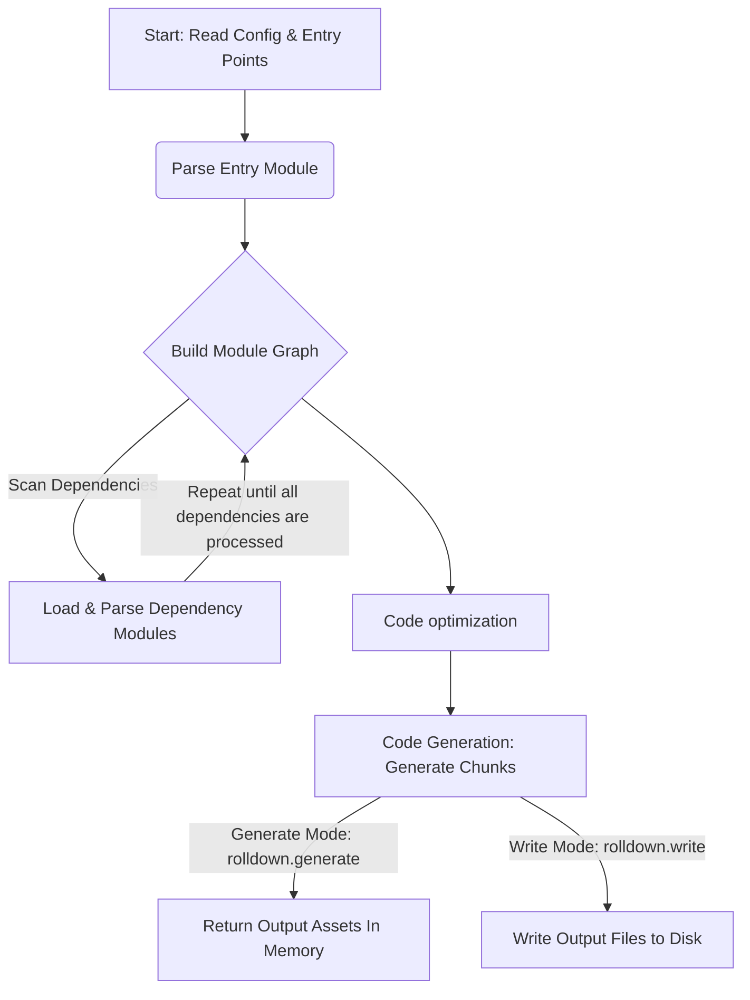
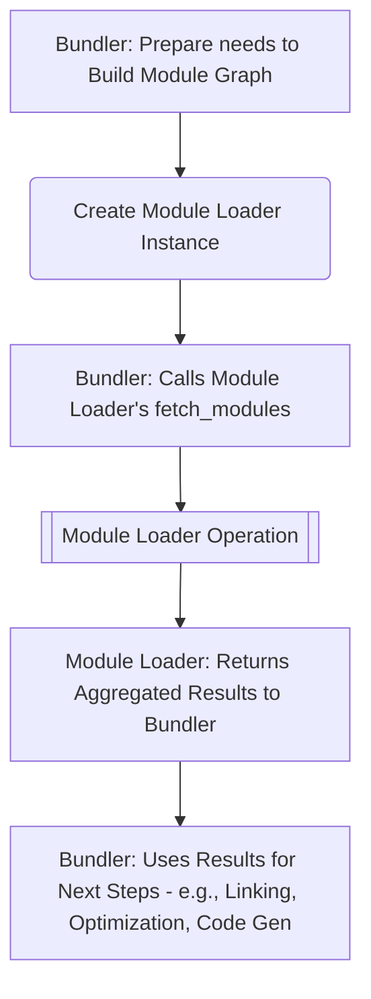
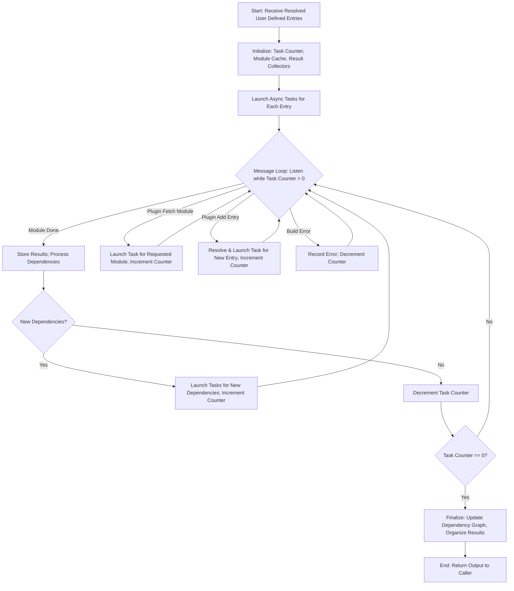

---

title: 'How Rolldown Works: Module Loading, Dependency Graphs, and Optimization Explained'
publishedAt: 2025-04-12
tags: ['rolldown', 'rust', 'bundler', 'dependency graph']
draft: false
description: 'A practical guide to understanding rolldown's high-performance module loader design'
audioLink: 'https://audio.atriiy.me/Rolldown_%20Module%20Loading%2C%20Dependency%20Graphs%2C%20and%20Optimization.mp3'

---

## Introduction

Rolldown is a blazing-fast JavaScript bundler written in Rust, designed to work seamlessly with the [Rollup](https://rollupjs.org/) API. The primary goal of it is to power [Vite](https://vite.dev/) as its unified bundler in the near future. Right now, Vite relies on esbuild for lightning-quick local development and Rollup for production builds. Switching to a single bundler like Rolldown promises to streamline the process, giving developers more confidence that what they see in development matches what goes live. Plus, Rolldown delivers bundling speeds that potentially 10 ~ 30 times faster than Rollup. Curious for more? Check out the [official Rolldown documentation](https://rolldown.rs/guide/) for all the details.

In this article, we’ll begin with a high-level overview of Rolldown to give you a panoramic understanding of how it works. This will help you stay oriented and avoid getting lost in the details too early. From there, we’ll dive into the core focus of this article: the **module loader**, the heart of Rolldown’s scan stage. We’ll explore its key functions and the important data structures that support it.

After that, we’ll discuss the **dependency graph** and some of the **performance optimizations** Rolldown employs. While a few of these topics may have come up before, they’re worth revisiting in context — and they play a crucial role in understanding how Rolldown achieves its speed and efficiency.

Okay, let’s roll into Rolldown. 😉

## High-level overview of Rolldown

Rolldown has four main steps: **dependency graph construction**, **optimization**, **code generation / bundling**, **output**. The output bundle will be written into memory or file system depends on if it’s for local development or production building. You can find the entry module in `crates/rolldown/src/bundler.ts`. Here is a diagram about the process.



The module loader is a core part of **build module graph** stage. It’s invoked from the `scan` function within the `Bundler` struct. The entire scanning process has been encapsulated into a dedicated `ScanStage` struct for better separation of concerns.

The real work, however, happens inside the `ModuleLoader`. It handles key tasks like building the dependency graph and processing individual modules. It’s where many heavy lifting happens — and the main focus of this article.

## Module loader

In short, the **module loader** is responsible for locating, fetching, and parsing individual modules — including source files, CSS, and more. It transform them into an internal data structure that the bundler can understand and work with. This step is crucial for building an accurate and efficient module graph.

Here’s a diagram showing how Rolldown uses the module loader during the bundling process:



All of these steps happen inside the `scan` function of the `ScanStage`. You can think of it as a builder that orchestrates and encapsulates the logic required to run the module loader.

### Fetch modules

`fetch_modules` is where the magic begins. It acts like a scheduler, kicking off a series of async tasks to parse all related modules. This function processes the user-defined entry points — the starting point of the module scanning algorithm.

Before reaching `fetch_modules`, the `scan` function resolves these entries and transforms them into the internal `ResolvedId` structure. This preprocessing step is handled by the `resolve_user_defined_entries` function.

Here’s a diagram showing the core workflow of the `fetch_modules` function:



Looks a bit complex, right? That’s because this stage packs in a lot of optimizations and features. But don’t worry — we can skip the finer details and focus on the high-level flow.

As mentioned earlier, the `fetch_modules` function takes the resolved user-defined entries as input and begins processing. For each entry, it calls `try_spawn_new_task`, which determines whether the module is internal or external, applies the appropriate logic, and returns a type safe `ModuleIdx`. This index is later used to reference the corresponding module throughout the system.

Once the initial tasks are spawned for all entries, `fetch_modules` enters a loop to listen on a message channel defined using `tokio::sync::mpsc`. Each module processing task holds a sender handle to this channel and reports events back to the main process. The message listener inside `fetch_modules` reacts to these messages, which includes:

- **Normal / Runtime module done**: Store the result and schedules any dependent modules.
- **Fetch module**: Responds to plugin requests to load specific modules on demand.
- **Add entry module**: Adds new entry points during scanning, typically triggered by plugins.
- **Build erros**: Captures any errors that occur during loading or transformation.

Once all modules have been processed and no more messages are incoming, the channel is closed and the loop exits. Then, `fetch_modules` performs some cleanup: it stores the processed entry points, updates the dependency graph, and returns an aggregated result back to the caller — the `scan` function. This result inclues modules, ASTs, symbols, entries, warnings, and more, all of which will be used in the upcoming optimization and code generation phases.

### Spawn new task

The function `try_spawn_new_task` first tries to retrieve the `ModuleIdx` from the module loader’s cache. Since the scan stage essentially traverses a graph, this cache tracks the visit state of each module using a hash map — where the key is the module’s ID and the value indicates whether it has already been processed.

Next, based on the module type, it transforms the module into either a normal module or an external module structure for further processing. It’s important to understand how **external modules** are handled. These modules aren’t bundled by Rolldown — they’re expected to be provided by the runtime environment, like libraries from `node_modules`. Although they’re not included in the final bundle, Rolldown still records metadata about them, effectively treating them as placeholders. The bundle assumes these modules will be available at runtime and will reference them as needed.

On the other hand, **normal module** — typically created by the user — are processed differently. For each of them, `try_spawn_new_task` creates a dedicated module task and runs it asynchronously. These tasks are managed by Tokio, Rust’s asynchronous runtime. As mentioned earlier, each task holds a _sender_ for the message channel, which it uses to report errors, newly discovered imports, or dynamically added entry points as it runs.

### Data structures

To improve performance and code reusability, Rolldown makes extensive use of specialized data structures. Understanding a few key ones used in the module loader will give you a clearer mental model of how the scan process works under the hood.

**ModuleIdx & HybridIndexVec**

`ModuleIdx` is a custom numeric index that gets assigned dynamically as modules are processed. This kind of index is beneficial for both **type safety** and **performance**. Instead of passing around or cloning entire module structures, Rolldown uses this lightweight identifier — much like a pointer in other programming languages — to reference modules throughout the system.

```rust
pub struct ModuleIdx = u32;
```

`HybridIndexVec` is a smart, adaptive container used to store module data. Since Rolldown operates primarily on `ModuleIdx` values rather than the actual module data, efficient ID-based lookup is essential. This is where `HybridIndexVec` comes in — it’s optimized for different bundling scenarios.

```rust
pub enum HybridIndexVec<I: Idx, T> {
  IndexVec(IndexVec<I, T>),
  Map(FxHashMap<I, T>),
}
```

Bundlers typically work in two modes:

- **Full bundling** (common in production builds), where all modules are scanned once and stored continuously. For this case, Rolldown uses a compact and performant structure called `IndexVec`, which behaves like a vector but enforces type-safe indexing.
- **Partial bundling** (often used in development), where the module graph can change frequently — for example, when a developer edits a file. In this case, a **sparse** structure is more appropriate. Rolldown uses a hash map based on the `FxHash` algorithm for fast key / value access.

`FxHash` is faster than Rust’s default hashing algorithm, though it has a slightly higher chance of collisions. Since both the keys and values are managed internally, and predictable performance is more important than security, this tradeoff is acceptable for Rolldown’s use case.

**Module**

Normal module are user-defined — typically source files that need to be parsed, transformed, or analyzed. Rolldown loads these files and processes them based on their file extensions. For example, `.ts` (TypeScript) files are parsed using Oxc, a high-performance JavasScript / TypeScript parser.

```rust
pub enum Module {
  Normal(Box<NormalModule>),
  External(Box<ExternalModule>),
}
```

The internal `NormalModule` struct stores detailed information about each module, including basic metadata like `idx` and `module_type`, as well as richer representations of the module’s content. Depending on this file type, these can includes:

- `ecma_view` for JavaScript / TypeScript modules
- `css_view` for stylesheets
- `asset_view` for static assets

This structure allows later stage of the pipeline — such as optimization and code generation — to work efficiently with the parsed content.

**ScanStageCache**

This is a structure holds all cache during module loading. Here is the data structure definition.

```rust
pub struct ScanStageCache {
  snapshot: Option<NormalizedScanStageOutput>,
  pub module_id_to_idx: FxHashMap<ArcStr, VisitState>,
  pub importers: IndexVec<ModuleIdx, Vec<ImporterRecord>>,
}
```

`snapshot` holds the result s of a previous scan stage and is used to support **incremental builds**. Instead of re-scanning everything from scratch, Rolldown can reuse parts of the previous scan, dramatically improving build times when only a few files have changed.

`module_id_to_idx` is a hash map that stores the mapping between a module’s ID and its visit state. It allows the program to quickly determine whether a module has already been processed.

The key is an `ArcStr`, which is a memory-efficient, reference-counted string optimized for sharing across threads. More importantly, this string is a **global unique and stable identifier** for the module — and remains consistent across multiple builds, which is critical for cache reliability.

`importers` represents a **reverse adjacency table** of the module graph. For each module, it tracks **which other modules import it**. This is particularly useful during incremental builds: when the content of module changes, `importers` helps Rolldown quickly determine the scope of affected modules — essentially identifying what needs to be reprocessed.

Note that temporary version of `importers` is also stored inside `IntermediateNormalModules`. You can think of it as a **draft state**, created dynamically during the current build process on the fly.

## Dependency graph

The **dependency graph** describes how modules depends on each other — and it’s one of the most important outputs of the scanning stage. Rolldown uses this relationship map in later phases for tasks like tree shaking, chunking, and code generation.

Before diving into the actually implementation, let’s take a moment to introduce the concept of an **adjacency table**, which plays a key role in how the graph is represented and traversed.

### Graph and Adjacency table

As we all know, a graph is a data structure used to represent **connections** between things. It consists of:

- Nodes — the items or entities being connected
- Edges — the connections or relationships between those nodes

There are two common ways to represent a graph: **adjacency matrix** and **adjacency table**.

An adjacency matrix is a 2D grid (or matrix) where each row and column corresponds to a node. The value at a given cell indicates whether an edge exists between the two nodes. For example, a `1` might mean there’s a connection, and a `0` means there’s not.

```
  | A | B | C
A | 0 | 1 | 0
B | 1 | 0 | 1
C | 0 | 1 | 0
```

This approach is simple and works well for dense graphs, where most nodes are connected. However, it’s memory-inefficient for sparse graphs, which is usually the case for module graphs in a bundler like Rolldown. (I believe no one wants to import everything into every single module in their project. 😉)

An adjacency table is a collection where each node keeps a list of its neighbors. Instead of using a fixed-size grid, it stores only the actually connections, making it more efficient for sparse graphs.

For example, if a node A is connected to node B, and B is connected to A and C, finally the C is connected to B.

```
A → [B]
B → [A, C]
C → [B]
```

This structure is memory-efficient and scalable for large, sparse graphs-like the module graph used in a bundler such as Rolldown. It also makes it easier to traverse only the relevant connections, which is useful during scanning or optimization phases.

### Forward & reverse dependency graph

In the scan stage, Rolldown builds two types of dependency graphs: **forward** and **reverse**. The forward graph is stored in the `ecma_view` of each module and records the modules imported by the current one.

```rust
pub struct ecma_view {
  pub import_records: IndexVec<ImportRecordIdx, ResolvedImportRecord>,
  // ...
}
```

The forward dependency graph is essential for bundling. The module loader starts from the user-defined entry points and builds this graph to determine which modules need to be included in the final bundle. It also plays a key role in determine execution order and managing variable scopes.

In addition, the module loader creates a **reverse dependency graph**, which makes it easy to track which modules import a given module. This critical for features like tree shaking, side-effect analysis, incremental builds, chunking, and code splitting.

These features involve a lot of context, so we won’t dive into them here. But you can think of it like this: _If I (module) change, who will be effected?_ The modules that depend on the changed module need to be reprocessed. This is the core idea behind implementing incremental builds or hot module replacement (HMR).

## Performance optimization

Rolldown includes a number of performance optimizations under the hood. Thanks to Rust’s zero-cost abstractions and ownership model — combined with Tokio’s powerful async runtime — developers have the tools they need to push performance to the next level. The module loader itself employs several techniques to speed things up, which we’ll talk through briefly here. Most of them should be discussed before.

### **Async concurrency processing**

Concurrency is at the heart of the module loader. As mentioned earlier, its main responsibility is to traverse all modules and build the dependency graph. In real-world projects, import relationships can quickly become complex and deeply nested — which makes asynchronous concurrency critical.

In Rust, `async` and `await` are the fundamental building blocks of async functions. An `async` function returns a `Future`, which won’t execute immediately — it runs only when explicitly awaited. Rolldown relies on Tokio, Rust’s most widely used async runtime, to execute these module processing task concurrently and efficiently.

### **Cache**

Given that Rolldown performs many async operations — and often runs repeatedly in local development environments — caching becomes essential to avoid redundant work.

The module loader’s cache is stored within the `ModuleLoader` struct. It includes data like `snapshot`, `module_id_to_idx`, and `importers`, most of which we introduced in earlier sections. These caches help Rolldown avoid reprocessing the same modules and make incremental builds significantly faster.

## What’s next

Rolldown is still under active development. In the future, it’s expected to become the underlying engine of Vite, offering consistent builds and ultra-fast performance. You can check out the roadmap [here](https://github.com/rolldown/rolldown/discussions/153).

I wrote this piece to capture my journey with Rolldown, and I hope it also demystifies some of its most impressive inner workings for you. If you spot an error or think something’s missing, drop a comment below—I’d love to hear your feedback! 😊

Thanks for reading, and see you in the next post!
